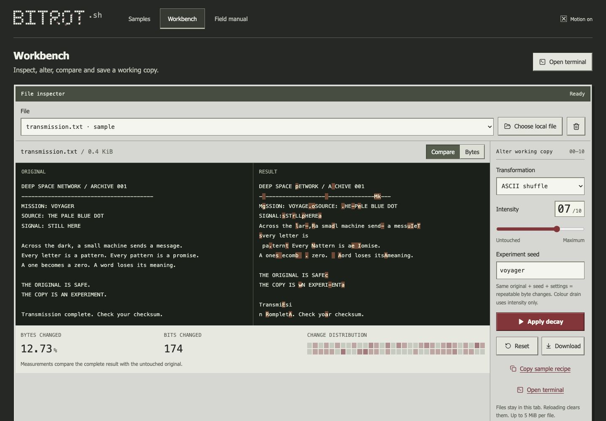
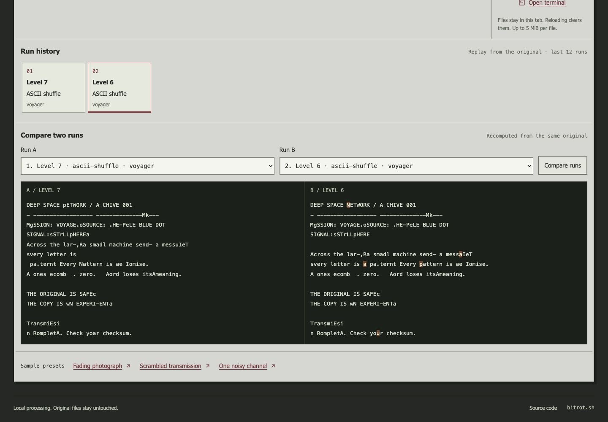
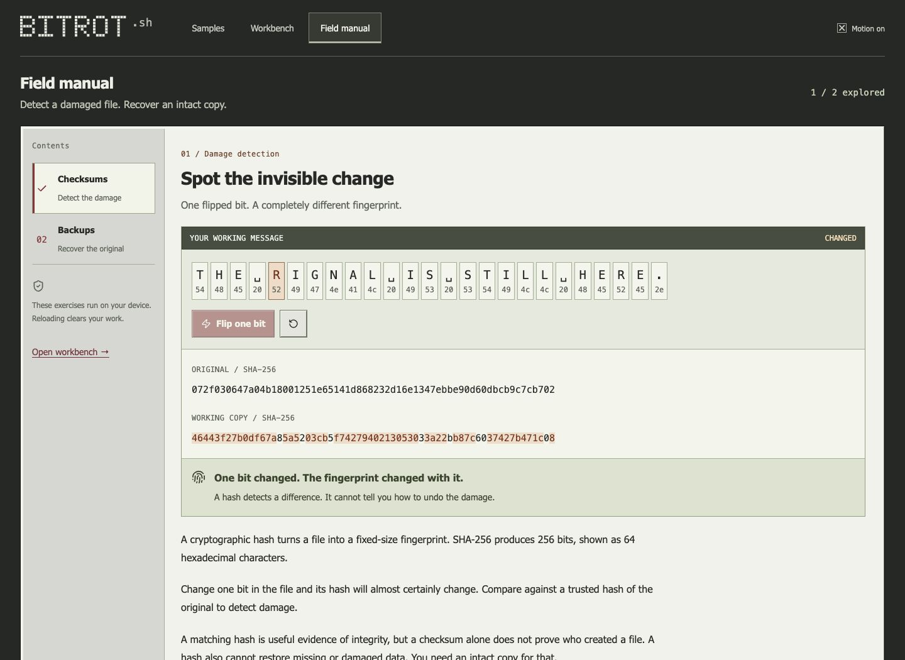
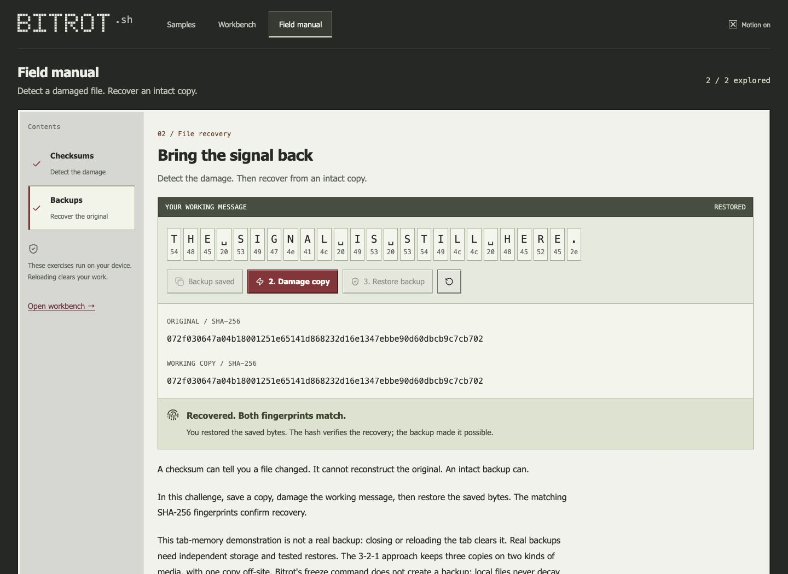
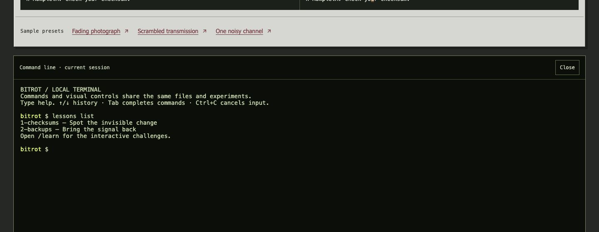
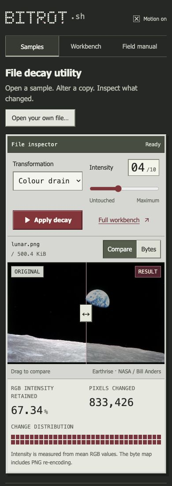

# Bitrot

**A vintage file utility for experimenting with data decay.** Open a sample or a local file, change a copy, inspect the damage, and learn how checksums and backups help preserve the original.

[Try Bitrot](https://bitrot.sh) · [Open the workbench](https://bitrot.sh/lab) · [Read the field manual](https://bitrot.sh/learn) · [Terminal commands](docs/COMMANDS.md) · [Development](docs/DEVELOPMENT.md)

The sample directory and inspector put the experiment first. These are real transformations and measurements performed in your browser; selected files are not uploaded.


*Live homepage: the bundled Earthrise PNG at colour-drain level 4. Drag the divider to compare the untouched original with the working copy.*

## Try an experiment

1. Open [Bitrot](https://bitrot.sh) and select an entry in the **Sample directory**.
2. Adjust **Transformation** and **Intensity**, then inspect **Compare** or **Bytes**. The compact homepage applies slider changes automatically; **Apply decay** runs the selected settings again.
3. Open **Full workbench** to choose your own file, set a seed, replay runs, compare results, download a copy, or share a sample recipe.

The three presets are ready to run:

| Experiment | Sample and transformation | Settings |
| --- | --- | --- |
| [Fading photograph](https://bitrot.sh/lab?v=1&sample=lunar&mode=color-drain&level=5&seed=apollo) | NASA Earthrise PNG; darkens RGB channels. | Level 5; colour drain ignores the seed. |
| [Scrambled transmission](https://bitrot.sh/lab?v=1&sample=transmission&mode=ascii-shuffle&level=7&seed=voyager) | Bundled fictional transmission; swaps ASCII characters. | Level 7; seed `voyager`. |
| [One noisy channel](https://bitrot.sh/lab?v=1&sample=transmission&mode=bit-flip&level=3&seed=signal) | The same transmission; flips selected bits. | Level 3; seed `signal`. |

## Inspect and transform files

The [workbench](https://bitrot.sh/lab) shares one session with the homepage and terminal. Select a loaded file, apply a transformation, and inspect the result without changing the original on disk.



*The version 1 Scrambled transmission preset changes 49 of 385 bytes and 174 bits. Measurements cover the complete file.*

### Three transformation modes

| Mode | What it changes | Supported input |
| --- | --- | --- |
| `color-drain` | Darkens RGB channels according to intensity and re-encodes the image as PNG. | A decodable PNG within the image limits below. |
| `ascii-shuffle` | Swaps characters using a reproducible seed. | Plain ASCII bytes. Non-ASCII text is rejected. |
| `bit-flip` | Flips selected bits using a reproducible seed. The result might no longer open. | Any file within the size limit. |

Intensity runs from **0 to 10**. Level 0 returns an unchanged copy. Every run starts from the original, so repeated experiments do not accumulate damage on the previous result.

### Preview and measurement tools

- **Image comparison:** move the original/result divider with a pointer, touch, or keyboard. PNGs are decoded into canvases. A damaged image that no longer decodes shows an error instead of executing its contents.
- **Text comparison:** see changed characters highlighted beside the original. The text preview shows the first 1,800 bytes.
- **Hex inspection:** select **Bytes** to inspect the first 192 result bytes. Changed values are highlighted; their tooltips report offsets and original/result values. Non-PNG inputs containing non-ASCII bytes use this view automatically.
- **Change map:** 64 cells show where changes are concentrated across the complete file. Darker cells indicate more changes.
- **Measured results:** byte transformations report changed-byte percentage and changed-bit count. Colour drain reports retained mean RGB intensity and changed pixels. Its byte map also includes PNG re-encoding changes.
- **File actions:** load and switch files, reset the working copy, download the result, or remove a file and its history from the tab. The terminal can also download the original with `view <id> 0`.

### Seeds, history, and shared recipes

Use an **Experiment seed** of 1–32 ASCII letters, digits, hyphens, or underscores. The same original, recipe version, seed, mode, and level reproduce the same byte transformations. Colour drain uses intensity only; encoded PNG bytes can differ between browsers even when the pixel operation is the same.

Each file keeps its **last 12 runs** as settings and measurements. Select a history entry to replay it from the original. **Compare two runs** recomputes the selected runs and displays their outputs side by side.

<details>
<summary>Screenshot: run history and comparison</summary>



*Comparison highlights differences between the two selected results, rather than between a result and the original.*

</details>

**Copy sample recipe** creates a URL containing only the bundled sample identifier, recipe version, mode, level, and seed. Opening the link runs that experiment. Locally selected files cannot be shared this way; filenames, file IDs, and file contents never enter recipe links. Unsupported or invalid recipes produce a recoverable error.

## Learn to detect and recover damage

The [field manual](https://bitrot.sh/learn) contains two interactive exercises:

| Exercise | What you do | What it demonstrates |
| --- | --- | --- |
| [Checksums](https://bitrot.sh/learn) | Flip one bit in a working message and compare its original and changed SHA-256 hashes. | A small byte change produces a different fingerprint. A hash detects a difference; it cannot restore the original. |
| [Backups](https://bitrot.sh/learn?lesson=backup) | Save an intact copy, damage the working message, then restore the saved bytes. | Matching hashes verify recovery. Without a saved copy, restart the exercise and create a backup first. |

The exercises use actual bytes and Web Crypto SHA-256, show the changed bytes and hash characters, and track completion for the current visit.



*This is an in-memory teaching exercise. Its saved copy disappears when the page reloads; it is not a durable backup of your files.*

<details>
<summary>Screenshot: restoring an intact backup</summary>



</details>

## Use the terminal

Choose **Open terminal** in the workbench. Commands and visual controls use the same files, transformation engine, and run history.

```text
preset 2
list
recipe <id>
rot <id> --level 5 --mode ascii-shuffle --seed voyager
view <id>
replay <id> 1
lessons list
```

Replace `<id>` with the file ID printed by `preset` or `list`. `rot` updates the visual result; `view` downloads it.

The terminal includes local file selection (`load`, with `upload` as a compatibility alias), file selection and removal, bundled samples, presets, replay, recipe links, lesson text, and `help`. Use Up/Down for command history, Tab for prefix completion, and Ctrl+C to discard the current input. Tab from an empty prompt and Shift+Tab leave the terminal. A running transformation has a timeout; Ctrl+C does not cancel that worker.

The original diversions remain: `cow`, `doge`, `parrot`, `matrix`, `xyzzy`, `id10t`, and `sudo make me a sandwich`. Any key stops `matrix`. `freeze` explains that files never decay automatically; it does not create a backup.

<details>
<summary>Screenshot: the local terminal</summary>



</details>

See the [terminal guide](docs/COMMANDS.md) for syntax, examples, and compatibility behavior.

## Phone and keyboard controls

On narrow screens, the homepage places controls above the image and the sample directory below the inspector. Selecting a sample brings the inspector into view and moves keyboard focus there. Navigation, native form controls, visible focus outlines, and image/range sliders support keyboard use.

The pixel wordmark changes with the current decay intensity. **Motion** controls visual effects, and the application respects reduced-motion preferences and pauses effects in hidden tabs. The terminal and legacy incident views load only when opened.

<details>
<summary>Screenshot: the phone layout</summary>



*Browser viewport capture; not a photograph of a physical phone.*

</details>

## Local files and limits

File names, original bytes, working copies, history, seeds, and lesson backups stay in tab memory. Reloading or closing the page clears them. Only the visual-effects preference is saved in browser storage. Download any result you want to keep before leaving.

| Limit | Value |
| --- | --- |
| File size | 5 MiB per input or result |
| Files in a tab | 10 |
| Total original bytes | 20 MiB |
| PNG dimensions | At most 4 million pixels and 4096 pixels per side |
| Intensity | Integers from 0 to 10 |
| Transformation time | Five-second worker timeout |
| Retained history | Last 12 runs per file |

Empty files are rejected. The store retains the original and latest result, plus history metadata. Workers and two-run comparisons also use temporary buffers. Processing is bounded and runs in a dedicated browser worker.

Text is escaped. Locally selected HTML and SVG files are never embedded or executed as documents. Downloads use opaque binary blobs. The retired cloud-file endpoints (`/upload`, `/list`, `/view`, `/rot`, and `/freeze`) return HTTP 410. The old scheduled decay job is inactive. Existing stored objects are not migrated or deleted by this application.

## Run locally

Use Node.js 22 and npm, matching CI:

```bash
npm ci
npm run dev
```

Open the printed Vite URL. Samples, local file selection, processing, terminal commands, and lessons work without Cloudflare credentials or storage bindings.

```bash
npm audit --audit-level=moderate
npm run typecheck
npm test
npm run build:functions
npm run build
```

Lesson source lives in `content/lessons/*.json`. Development and build scripts generate the browser content and compatibility text files automatically; `npm run lessons:build` runs that step directly.

See the [developer guide](docs/DEVELOPMENT.md) for the shared store, worker API, lesson pipeline, and deployment. The [browser checklist](docs/BROWSER-CHECKS.md) records interaction coverage and its limits. The existing Cloudflare Pages integration deploys `main`; automatic branch deployments remain paused.

## Earlier security demonstrations

The repository also retains separate, bundled security-content examples:

- [`/attack`](https://bitrot.sh/attack): a terminal-styled attack-flow viewer.
- [`/incident`](https://bitrot.sh/incident): a historical narrative report with a React Flow graph.
- [`/inc`](https://bitrot.sh/inc): an incident-dashboard demo with timeline search, severity filters, and expandable details. Response and export buttons are presentation placeholders, not operational integrations.

These views are not connected to a live SIEM or response service. See the [incident demo notes](INCIDENT_DEMO.md).

## Screenshots, source, and contributions

Current screenshots are actual captures of [bitrot.sh](https://bitrot.sh) at the vintage-utility release. See [image provenance](docs/images/README.md) for dates, viewport sizes, recipes, and retained historical artwork. The Earthrise sample is credited to NASA / Bill Anders; [sample provenance](public/samples/README.md) records its source. The transmission is fictional.

Bitrot uses React, TypeScript, Vite, xterm.js, and Cloudflare Pages. Issues and focused pull requests are welcome. Recipe v1 is a compatibility contract: changing its byte algorithm or bundled sample bytes requires a versioning decision and updated fixtures.

Apache 2.0. Created by [Jim Saveker](https://github.com/jsaveker).
