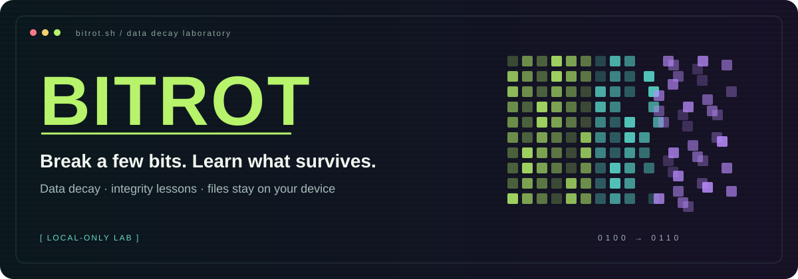
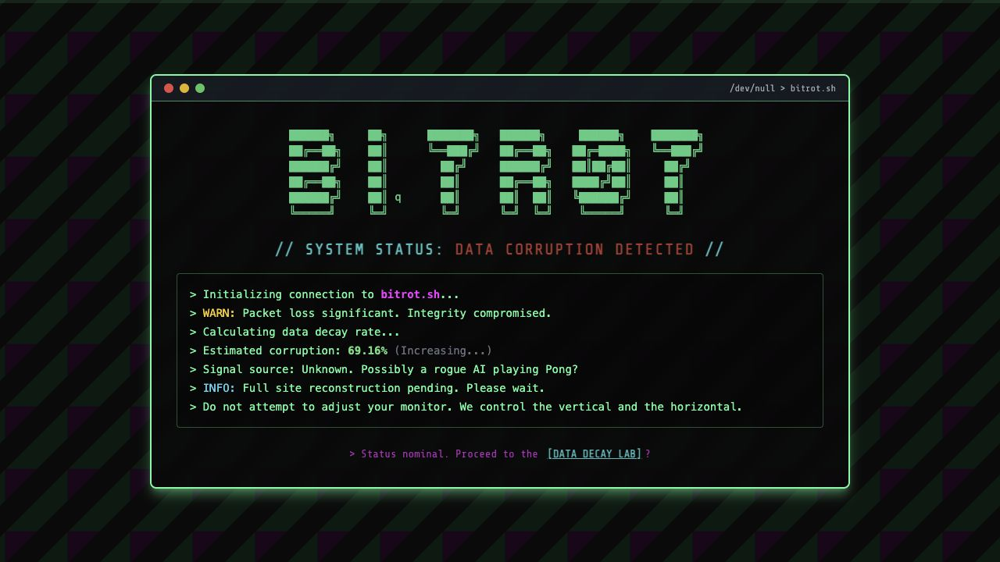
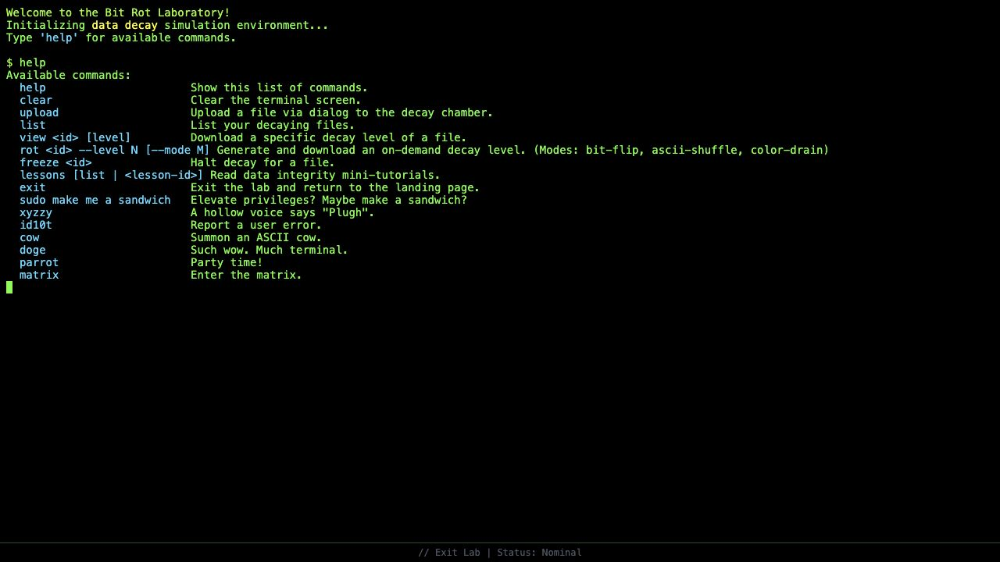
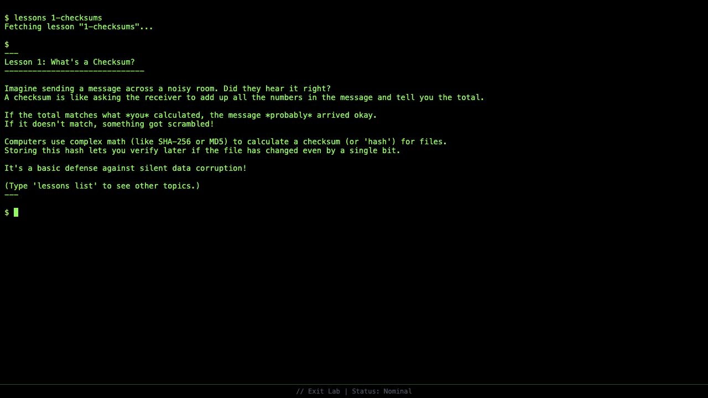
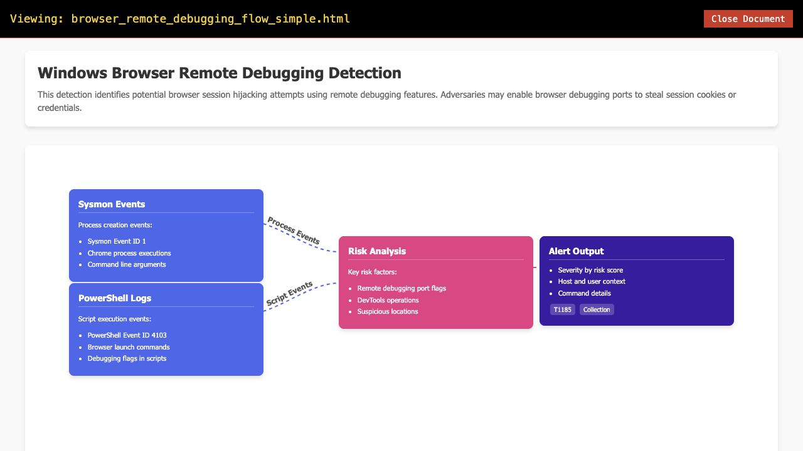
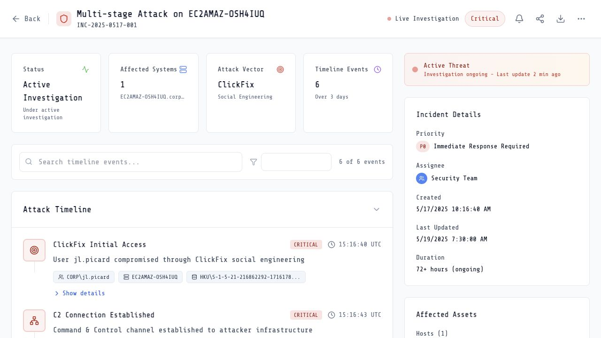
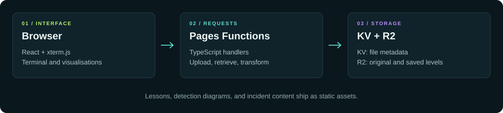

<p align="center">
  
</p>

<p align="center">
  <strong>A terminal playground for data decay, integrity lessons, and security visualisations.</strong><br />
  Deliberately corrupt disposable files. Explore how data changes. Follow the evidence in an attack timeline.
</p>

<p align="center">
  <a href="https://bitrot.sh"><strong>Visit Bitrot ↗</strong></a> ·
  <a href="https://bitrot.sh/lab">Open the lab</a> ·
  <a href="docs/COMMANDS.md">Command guide</a> ·
  <a href="docs/DEVELOPMENT.md">Developer guide</a>
</p>

<p align="center">
  
  
  
  <a href="LICENSE"></a>
</p>



## Inside Bitrot

Bitrot combines a deliberately mischievous data-decay experiment with educational security content. The terminal is real: commands call Cloudflare Functions to store files, generate altered versions, and retrieve lessons. The corruption meter on the landing page is decorative.

| Explore                                                 | What you can do                                                                                          |
| ------------------------------------------------------- | -------------------------------------------------------------------------------------------------------- |
| [Data Decay Lab](https://bitrot.sh/lab)                 | Upload a disposable sample, list stored files, retrieve saved levels, and generate a corrupted download. |
| [Integrity lessons](docs/COMMANDS.md#learn-and-explore) | Read short introductions to checksums and backups directly in the terminal.                              |
| [Attack-flow library](https://bitrot.sh/attack/)        | Browse four detection diagrams covering ClickFix, browser remote debugging, and RMM tools.               |
| [Incident report](https://bitrot.sh/incident)           | Explore a historical incident narrative and an interactive graph of events and entities.                 |
| [Incident dashboard demo](https://bitrot.sh/inc)        | Search and filter six bundled timeline events, expand details, and explore MITRE ATT&CK mappings.        |

> **Experimental shared lab:** use only disposable, non-sensitive files. The current lab does not provide private user workspaces or a guaranteed deletion period. Keep your original files elsewhere; `freeze` is not a backup. The incident dashboard uses bundled historical data, and its response, sharing, and export buttons are presentation controls.

## A closer look

<table>
  <tr>
    <td width="50%"><br /><strong>A real command interface</strong><br />File experiments, lessons, and a few hidden distractions.</td>
    <td width="50%"><br /><strong>Learn while you experiment</strong><br />Short explanations of data integrity and recovery.</td>
  </tr>
  <tr>
    <td width="50%"><br /><strong>Follow the detection logic</strong><br />Visual guides connect evidence, analysis, and alerts.</td>
    <td width="50%"><br /><strong>Explore an incident</strong><br />A dashboard built around a bundled historical example.</td>
  </tr>
</table>

Screenshots show the existing application, captured in September 2026. See [image sources](docs/images/README.md) for capture details and reproducible artwork.

## Try the terminal

Open the [lab](https://bitrot.sh/lab), click inside the terminal, and enter:

```text
help
lessons list
lessons 1-checksums
```

For file experiments, start a [local lab](docs/DEVELOPMENT.md#run-the-local-lab) and use a small throwaway text file or PNG. The `upload` command opens a file picker and returns an ID. Files must be non-empty and no larger than **5 MiB**.

```text
upload
list
rot <file-id> --level 2 --mode ascii-shuffle
view <file-id> 0
```

Replace `<file-id>` with the ID returned by `upload`. `rot` generates a new download from the original; it does not save that generated result as an archive level. Random decay is not deterministic, so repeating a command can produce a different result.

| Decay mode      | Effect                            | Current scope                                                  |
| --------------- | --------------------------------- | -------------------------------------------------------------- |
| `bit-flip`      | Changes random bits in the file.  | Any bytes; the result may no longer open.                      |
| `ascii-shuffle` | Swaps characters in decoded text. | Best with simple ASCII text.                                   |
| `color-drain`   | Darkens PNG colour channels.      | Use an 8-bit RGBA PNG; other PNG formats may remain unchanged. |

JPEG glitch is a placeholder. Scheduled decay code exists, but requires a separately wired Worker and Cron Trigger; a Pages build alone does not enable it. See the [current implementation notes](docs/DEVELOPMENT.md#current-boundaries).

## Run locally

Use **Node.js 22** and npm, matching the CI environment.

```bash
git clone https://github.com/jsaveker/bitrot.git
cd bitrot
npm ci
npm run dev
```

Open the URL printed by Vite. This starts the **frontend only**: the landing page and incident views work, but uploads, lesson discovery, and the attack-flow index need Cloudflare Functions. The [developer guide](docs/DEVELOPMENT.md) covers local bindings, build checks, and hosting boundaries.

## How it fits together



- **Frontend:** React, Vite, Tailwind CSS, Framer Motion, and xterm.js.
- **Visualisations:** React Flow, Dagre, Lucide icons, and React Markdown.
- **Backend:** TypeScript Pages Functions with Cloudflare KV and R2.
- **Image processing:** WebAssembly PNG decoding and encoding through `@cf-wasm/png`.

## Contribute

Small, focused contributions are welcome. Useful areas include clearer first-run guidance, accessible terminal interactions, image-format support, and reproducible decay experiments. Open an [issue](https://github.com/jsaveker/bitrot/issues) to discuss larger changes, then include the relevant build checks and screenshots in your pull request.

Start with the [developer guide](docs/DEVELOPMENT.md), [terminal reference](docs/COMMANDS.md), or [incident demo notes](INCIDENT_DEMO.md).

## License

[Apache License 2.0](LICENSE). Created by [Jim Saveker](https://github.com/jsaveker).
